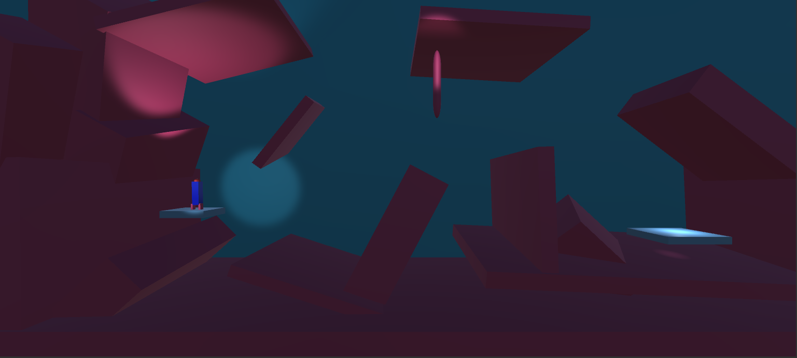
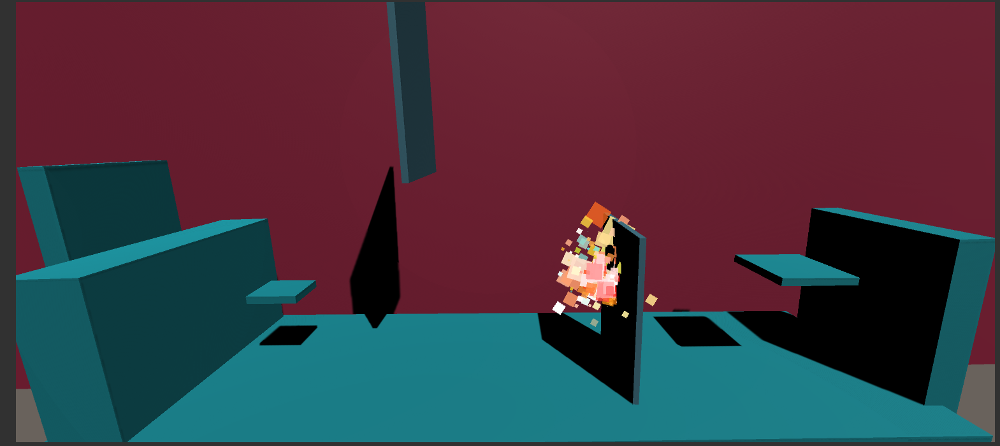
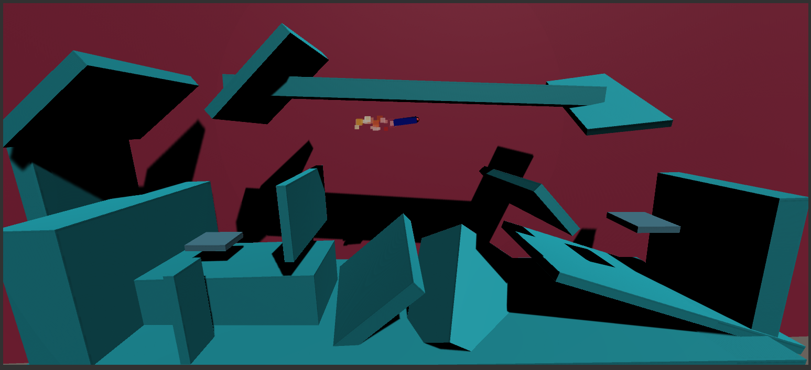
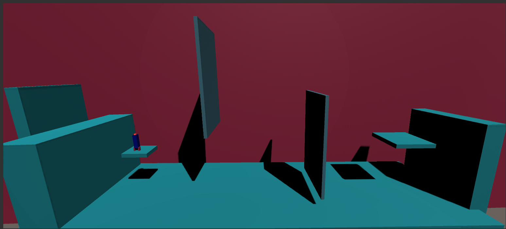

<h1>Rocket-Bootser</h1>
<h2>Rocket booster is space rocket game made with Unity 3D engine alot fun to play when every level becomes difficult to complete.</h2>
<h2>Tutorial</h2>
<ul>
<li>You have to fly your rocket and land it safely to the landing pad (Finish pad).</li>
<li>If you crashes or bump into any obstacle in any level the game restarts the same level.</li>
<li>It's small game of 5 levels only but game increases its difficulty once you finish a level.</li>
</ul>
<h2> Controls</h2>
<ul>
<li>"Space" for Thrusting (Fly)</li>
<li>"A" for left rotation</li>
<li>"D" for right rotation</li></ul>

